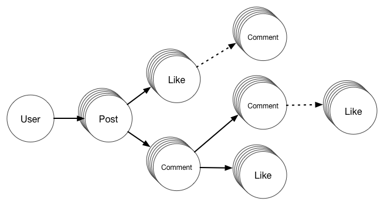

# gocrud
Go library to simplify creating, updating and deleting arbitrary depth structured data — to make building REST services fast and easy.

[Link to blog post](http://hacks.ghost.io/go-library-for-crud/)

This library is built to allow these properties for the data:

1. **Versioning**: Keep track of all edits to the data, including deletion operations.
1. **Authorship**: Be able to track who edited (/deleted) what.
1. **Retention**: On deletion, only mark it as deleted. Never actually delete any data.

The library makes it easy to have *Parent-Child* relationships, quite common in today’s CRUD operations. For e.g.
```
- Posts created by User (User -> Post)
- Comments on Posts (Post -> Comment)
- Likes on Posts (Post -> Like)
- Likes on Comments (Comment -> Like)
```
And be able to traverse these relationships and retrieve all of the children, grandchildren etc. For e.g. `(User -> Post -> [(Comment -> Like), Like])`

The library does this by utilizing Graph operations, but without using a Graph database. This means the library can be used to quickly build a Go backend to serve arbitrarily complex data, while still using your database of choice.

This library supports both SQL and NoSQL databases including other datastores, namely

1. Cassandra
1. LevelDB
1. Any SQL stores (via http://golang.org/pkg/database/sql/)
1. Google Datastore
1. _Any others as requested_

In fact, it exposes a simple interface for operations requiring databases, so you can easily add your favorite database (or request for addition).
```go
type Store interface {
  Init(string)
  Commit(tablePrefix string, its []*x.Instruction) error
  IsNew(tablePrefix string, subject string) bool
  GetEntity(tablePrefix string, subject string) ([]x.Instruction, error)
}
```

The data is stored in a flat “tuple” format, to allow for horizontal scaling across machines in both SQL and NoSQL databases. Again, no data is ever deleted, to allow for log tracking all the changes.

## Example Usage

Let's take a social backend as an example ([based on social.go](example/social/social.go))
- Users create posts
- Other users like Posts
- Other users comment on Posts
- Other users like the comments
- Other users comment on the comment (aka reply)
- (Extra) Other users like the comment on the comment
- (Extra) Other users comment on the like



A typical table for a Post would be like this:

##### POST
Column | Type | Description
--- | --- | ---
Id | string | Unique identifier of the post
VersionId | string | To identify edits to the post
Timestamp | time | Version creation time
Body | string | Content of the post
Url | string | Any urls shared
Image | blob | Any images shared
User | string | Author of the post
Privacy | int | Shared with self, friends or the world

##### Comment
Column | Type | Description
--- | --- | ---
Id | string | Unique identifier of the comment
VersionId | string | To identify edits to the comment
PostId | string | Id of parent post
CommentId | string | Id of parent comment
Timestamp | time | Version creation time
Body | string | Content of the comment
Url | string | Any urls shared
User | string | Author of the comment

and so on for **Like**. Then for each of these types, one would have to write functions to create, update, or delete these entities.
And while reading, one would have to join these tables to get the entire structured data. *All this would be a lot of effort on its own.*

### Instead, enter CRUD

*This is how various operations can be performed using gocrud library*
##### Create a new Post
```go
p := api.Get("User", userid).SetSource(userid).AddChild("Post")
p.Set("url", "www.google.com").Set("body", "You can search for cat videos here")
p.Set("tags", [arbitrary Go data]).Execute(ctx)
```

##### Like and Comment
```go
p := api.Get("Post", postid).SetSource(userid)
p.AddChild("Comment").Set("body", "Comment on the post")
p.AddChild("Like").Set("thumbsup", true).Execute(ctx)
```

##### Reply to comment
```go
c := api.Get("Comment", commentid).SetSource(userid)
c.AddChild("Comment").Set("body", "Comment on comment").Execute(ctx)
```

##### Comment on Like (*because we can, easily*)
```go
l := api.Get("Like", likeid).SetSource(userid)
l.AddChild("Comment").Set("body", "Nice that you like this").Execute(ctx)
```

##### Add some property `censored`
```go
api.Get("Comment", commentid).SetSource(uid).Set("censored", true).Execute(ctx)
```

##### Mark deleted
Something marked as deleted would never be retrieved.
```go
api.Get("Like", like.Id).SetSource(newUser()).MarkDeleted().Execute(ctx)
```

##### Read User
Now finally, read it all back
```go
q := api.NewQuery("User", uid).Collect("Post")
// Note that Collect() on a node would return child node query pointer,
// and run operations there.
q.Collect("Like").UptoDepth(10)
q.Collect("Comment").UptoDepth(10).FilterOut("censored")
result, err := q.Run(c)
js, err := result.ToJson()

// or directly to w http.ResponseWriter
result.WriteJsonResponse(w)
```

Sample result produced:
Full JSON
```json
{
    "Post": [
        {
            "Comment": [
                {
                    "Comment": [
                        {
                            "body": "Comment di on comment",
                            "id": "w0YDg",
                            "kind": "Comment",
                            "source": "uid_IxD",
                            "ts_millis": 1435373783693
                        }
                    ],
                    "Like": [
                        {
                            "Comment": [
                                {
                                    "body": "Comment j3 on Like",
                                    "id": "O1Kqv",
                                    "kind": "Comment",
                                    "source": "uid_avi",
                                    "ts_millis": 1435373783695
                                }
                            ],
                            "id": "PYuUz",
                            "kind": "Like",
                            "source": "uid_IxD",
                            "thumb": 1,
                            "ts_millis": 1435373783693
                        }
                    ],
                    "body": "Comment gI on the post",
                    "censored": true,
                    "id": "xcbbG",
                    "kind": "Comment",
                    "source": "uid_rfV",
                    "ts_millis": 1435373783696
                }
            ],
            "Like": [
                {
                    "id": "h5izf",
                    "kind": "Like",
                    "source": "uid_uQf",
                    "thumb": 1,
                    "ts_millis": 1435373783691
                },
                {
                    "id": "3P1RK",
                    "kind": "Like",
                    "source": "uid_Nab",
                    "thumb": 1,
                    "ts_millis": 1435373783692
                }
            ],
            "body": "You can search for cat videos here",
            "id": "6MV1v",
            "kind": "Post",
            "source": "uid_rWe",
            "tags": [
                "search",
                "cat",
                "videos"
            ],
            "ts_millis": 1435373783690,
            "url": "www.google.com"
        }
    ],
    "id": "uid_rWe",
    "kind": "User",
    "ts_millis": 0
}
```

JSON produced after removing node with `censored`, and the deleted nodes.
```json
{
    "Post": [
        {
            "Like": [
                {
                    "id": "3P1RK",
                    "kind": "Like",
                    "source": "uid_Nab",
                    "thumb": 1,
                    "ts_millis": 1435373783692
                }
            ],
            "body": "You can search for cat videos here",
            "id": "6MV1v",
            "kind": "Post",
            "source": "uid_rWe",
            "tags": [
                "search",
                "cat",
                "videos"
            ],
            "ts_millis": 1435373783690,
            "url": "www.google.com"
        }
    ],
    "id": "uid_rWe",
    "kind": "User",
    "ts_millis": 0
}
```

To see this in action, run this example:
```bash
go build example/social/social.go
./social

// Also a REST server
go build example/server/server.go
./server
```

These are fairly complex operations on fairly complex data structure,
CRUD for which would have been a lot of work to put together using typical
SQL / NoSQL table approach.
